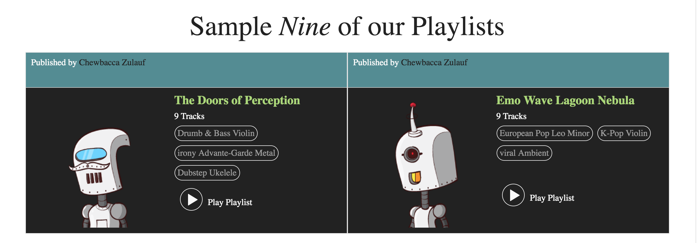
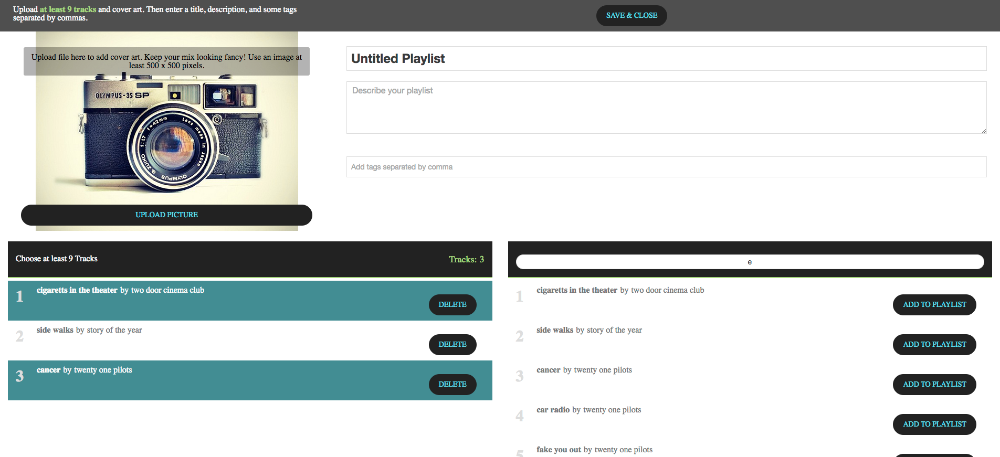
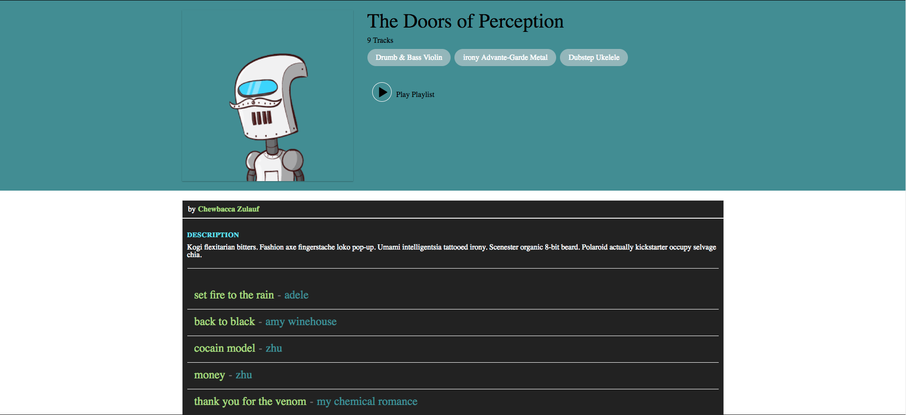
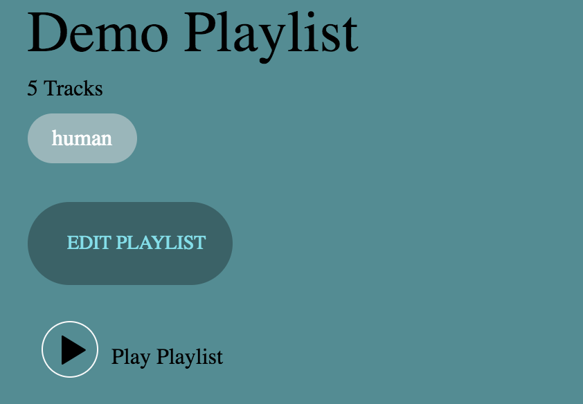

# NineTracks

View [NineTracks][website] Live

[website]: http://www.nine-tracks.website/#/


NineTracks is a full-stack web application inspired by 8Tracks. NineTracks was built using React.js in combination with Redux on the Front-End and Ruby on Rails on the Back-End. Postgreql is the database used for this project. The Bootstrap library was used to create the aesthetics of the page. Users may use the page without login, however if they would like to create their own playlists, they must have an account.


## Features & Implementation

### Playlists


These are examples of small playlists rendered on the home/feed/search pages. They are able to play songs and render their respective show pages by clicking the title or picture. Users can also go to the creator's profile page which renders the playlists which they have created.




In the database, playlists are stored in one, indexed table. The table contains the columns: `id`, `title`, `description`, `picture_url`, `user_id`, `username`, `timestamps`. Upon creation, the user's username and user_id is stored. Playlists have an association to `Songs` through a join table called `Mixes`, which stores and indexes the ID of the song and playlist. On the creation form, there is a search bar which dynamically searches the database for songs and allows users to add or remove songs from their playlists. This can be done from the edit mode too. Users can also upload their own picture using the `upload picture` button. The button uses the Cloudinary widget to send the picture to the project's Cloudinary account and stores the URL to that image in the database. Lastly, the user's tags will be stored as `Tag` instances in the database. If a tag already exists, Rails will find that tag and create an association through the `Taggings` join table with the playlist ID and the Tag ID, else make a new tag and create the association. Once the playlist is created or edited, the show page for the playlist is rendered.




The show page for the playlists displays all the details of the playlist. If the current user is the creator of the playlist, an edit button is rendered below the tags.




### Tags & Search
When a new Playlist is made, Rails creates a new Tag with the title of the playlist, and finds or creates the other tags in the database. Since playlists titles and tags are tags, they are able to be searched by typing a tag name into the search bar or by clicking on the tag name on the small playlists rendered on the feed/home/search/user_profile pages, or on the show page of the playlist.


### Play Bar
The Play Bar is a component which is rendered below the children in the application:

```javascript
import React from 'react';
import NavigationContainer from "NavigationContainer"
import PlayBarContainer from 'PlayBarContainer'

const App = ({ children }) => (
  <div>
    <NavigationContainer/>
    { children }
    <PlayBarContainer/>
  </div>
);
```

When a playlist's play button gets pressed, an action is dispatched which sends the selected playlist to the play bar. The playlist is then stored in the play bar's internal state and is unaffected by navigation. The songs are stored as an array on the playlist object and will play in that order in the play bar.


## Future Additions to NineTracks

### Improved Mobile Responsiveness
Since NineTracks utilizes the Bootstrap Library, additional media queries and Bootstrap classes will be added to make the site become more mobile friendly.

### Upload Songs
Since the playlist creation page uses Cloudinary, and the music on the site is hosted there as well. There will be an addition for users to add their own songs when creating or editing their playlists. This will utilize the Cloudinary widget and will store the song title, artist and user_id (ID of the uploader) in the database.
